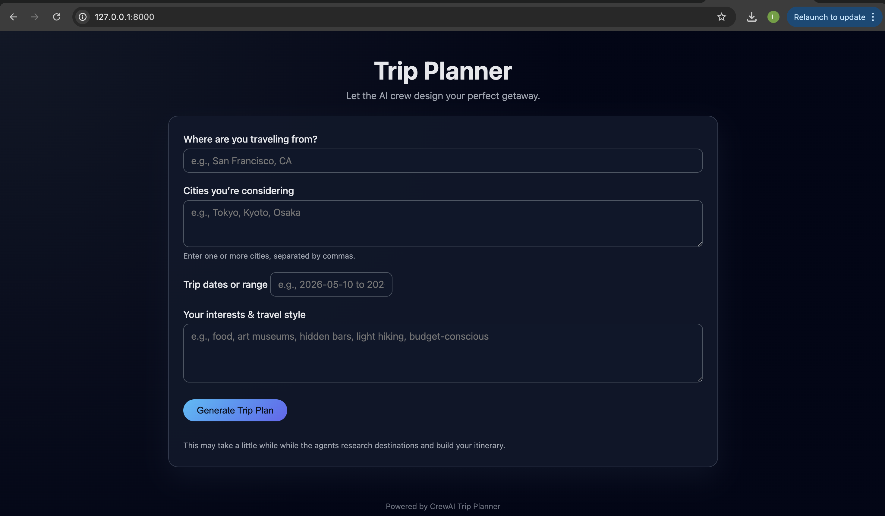
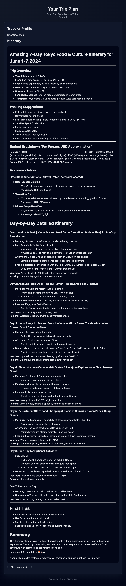

# AI Crew Trip Planner

<p align="center">
  
</p>

<p align="center">
AI-powered multi-agent trip planning using <b>CrewAI</b> with a <b>FastAPI web interface</b>.
</p>

---

## Overview

This project demonstrates how **CrewAI agents collaborate** to research travel destinations and automatically generate a complete trip itinerary.

The system uses multiple AI agents working together to:

- Research destinations
- Compare travel options
- Gather local insights
- Generate a structured itinerary

The project provides both:

- A **command line interface**
- A **browser-based web interface**

---

## Web Interface Preview

### Trip Input Form

<p align="center">
  
</p>

Users can enter:

- Origin city
- Candidate destinations
- Travel dates
- Travel interests

The request is sent to a **CrewAI multi-agent workflow** that researches destinations and generates a trip itinerary.

---

### Generated Trip Plan

<p align="center">
  
</p>

The generated result includes:

- Destination comparisons
- Local recommendations
- Suggested activities
- A structured travel itinerary

---

## Features

- Multi-agent collaboration using **CrewAI**
- AI-powered destination research
- Automated itinerary generation
- FastAPI web interface
- CLI version available
- Support for OpenAI and local LLMs

---

## Installation

Clone the repository and install dependencies using **Poetry**.

```bash
git clone https://github.com/yourusername/tripplanner.git
cd tripplanner
poetry install --no-root

## Dependencies

Dependencies are defined in:

- `pyproject.toml`
- `poetry.lock`

Install them with:

```bash
poetry install --no-root
```

---

## Environment Configuration

Create a `.env` file in the project root:

```env
OPENAI_API_KEY=your_openai_key
SERPER_API_KEY=your_serper_key
BROWSERLESS_API_KEY=your_browserless_key
```

These keys allow the agents to:

- Access LLM APIs
- Perform web search
- Retrieve webpage content

---

## Running the Web Application

Start the FastAPI server:

```bash
poetry run uvicorn web_app:app --reload
```

You should see output similar to:

```text
Uvicorn running on http://127.0.0.1:8000
```

---

## Open the Web Interface

Open your browser and navigate to:

```
http://127.0.0.1:8000/
```

You will see the **Trip Planner web interface**.

---

## Running the CLI Version

You can also run the trip planner directly from the terminal:

```bash
python main.py
```

Example prompts:

```
Beach vacation in Europe
Adventure trip in South America
Food tour in Japan
```

The AI agents will collaborate to produce a complete itinerary.

---

## Project Structure

```
TripPlanner
│
├── main.py
├── web_app.py
├── trip_agents.py
├── trip_tasks.py
│
├── tools
│   ├── search_tools.py
│   └── browser_tools.py
│
├── templates
├── static
│
├── assets
│   ├── input_form.png
│   └── trip_plan.png
│
├── pyproject.toml
├── poetry.lock
└── README.md
```